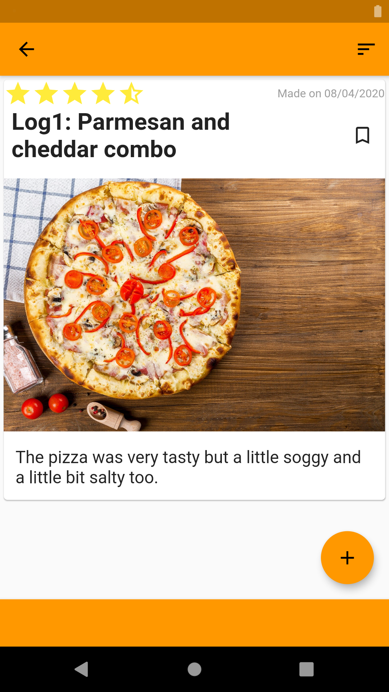
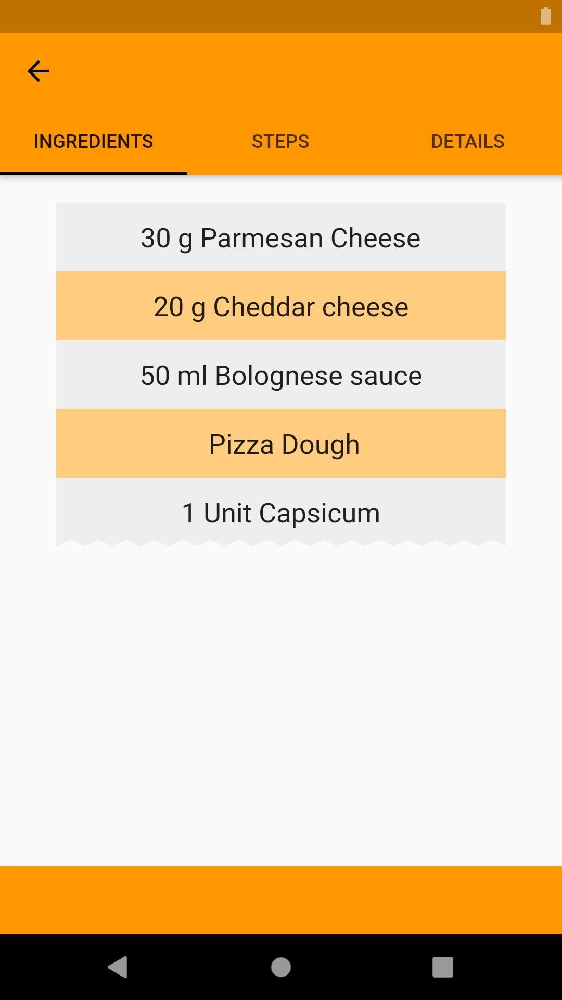
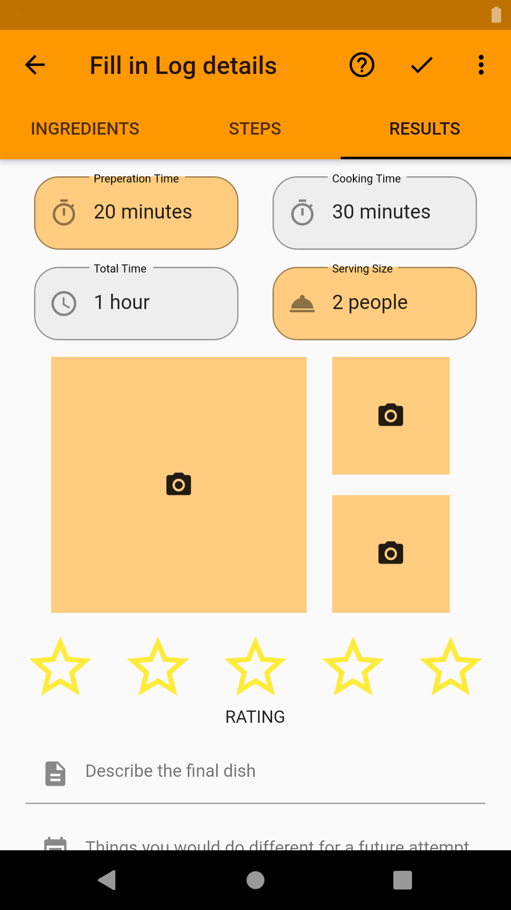
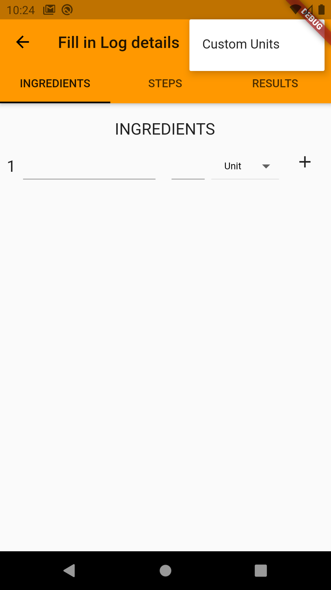
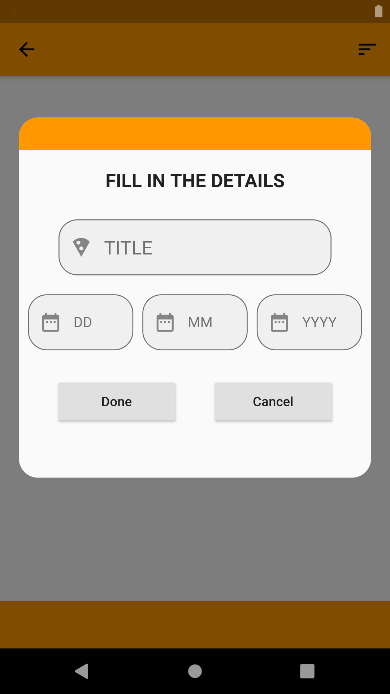
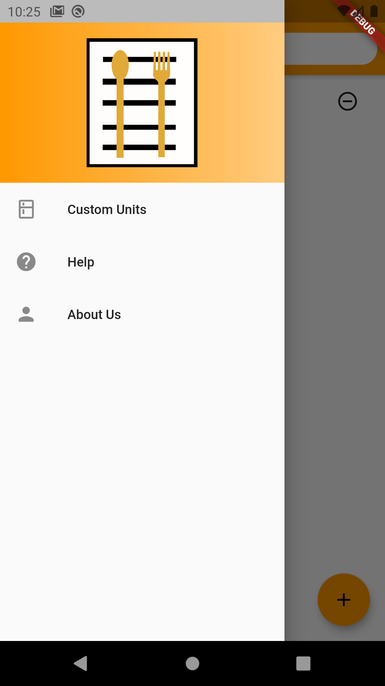

# Recipe Logger

This is a fully functioning application made using flutter which allows users to make logs of their dish. They can keep records of all their attempts at making a dish and rate it for future reference. Users can also make their own custom units for cooking. For example, a user can make a spoon they have as a unit for making dishes. They can also capture a image for it, so that they never forget it. All the data is stored locally on the device.

 |  | 

 |  | 
